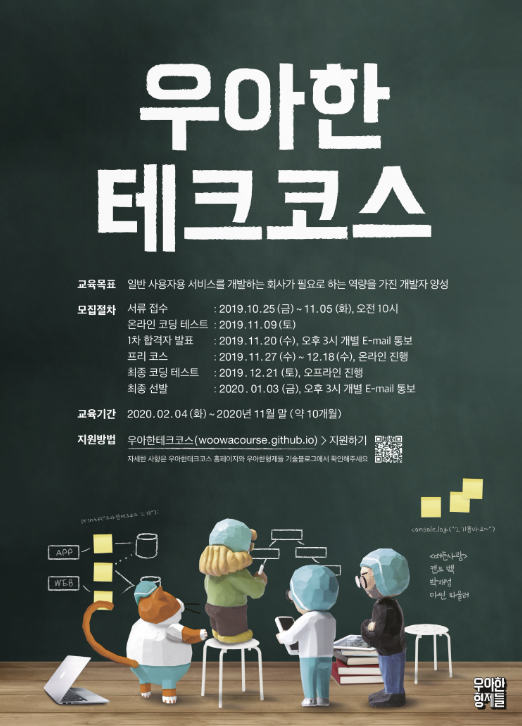

# 👨🏻‍💻 woowacourse-projects

    

 

## ⏳ Level 0 : 프리코스

### 기간

- 2023.11.27 ~ 2023.12.17

### 진행 미션

|     Project      |                          Repository                          |                         Pull Request                         |
| :--------------: | :----------------------------------------------------------: | :----------------------------------------------------------: |
|  숫자 야구 게임  | [java-baseball](https://github.com/chaewon121/java-baseball/tree/chaewon121) | [Pull Request](https://github.com/woowacourse-precourse/java-baseball/pull/1029) |
| 로또 | [java-lotto](https://github.com/chaewon121/java-lotto/tree/chaewon121) | [Pull Request](https://github.com/woowacourse-precourse/java-lotto/pull/1054) |
|      다리 건너기      | [java-bridge](https://github.com/chaewon121/java-bridge/tree/chaewon121) | [Pull Request](https://github.com/woowacourse-precourse/java-bridge/pull/1118) |

 

## ⌛️ Level 0.5 : 오프라인 테스트

### 기간

- 2023.12.24

### 진행 미션

| Project |                          Repository                          |                         Pull Request                         |
| :-----: | :----------------------------------------------------------: | :----------------------------------------------------------: |
| 점심 메뉴 추천  | [java-menu](https://github.com/chaewon121/java-menu/tree/chaewon121) | [Pull Request](https://github.com/woowacourse-precourse/java-menu/pull/171) |

 

## 🥚 Level 1 : 프로그래밍 기본

### 기간

- 2023.02.07 ~ 2023.04.10

### 학습 목표

- 자바 프로그래밍 언어에 대한 기본 문법을 익혀 프로그래밍하는 경험을 한다.
- 읽기 좋은 코드를 구현하는 것이 왜 중요한지와 코드를 개선해 읽기 좋은 코드로 변경해 보는 경험을 한다.
- 자신이 구현한 코드에 대해 단위 테스트와 리팩토링하는 경험을 한다.
- 객체지향에 대해 공부하고 적용하는 경험을 한다.

### 진행 미션

|     Project      |                          Repository                          |                         Pull Request                         |
| :--------------: | :----------------------------------------------------------: | :----------------------------------------------------------: |
|  자동차 경주 게임 / step1   | [java-racingcar/step1](https://github.com/chaewon121/java-racingcar/tree/chaewon121-step1) | [Pull Request](https://github.com/woowacourse/java-racingcar/pull/472) |
| 자동차 경주 게임 / step2 |  [java-racingcar/step2](https://github.com/chaewon121/java-racingcar/tree/step2)  | [Pull Request](https://github.com/woowacourse/java-racingcar/pull/630) |
|   사다리 타기 / step1   | [java-lotto/step1](https://github.com/chaewon121/java-ladder/tree/step1) | [Pull Request](https://github.com/woowacourse/java-ladder/pull/119) |
|   사다리 타기 / step2   | [java-lotto/step2](https://github.com/chaewon121/java-ladder/tree/step2) | [Pull Request](https://github.com/woowacourse/java-ladder/pull/226) |
|  블랙잭 / step1  | [java-blackjack/step1](https://github.com/chaewon121/java-blackjack/tree/step1) | [Pull Request](https://github.com/woowacourse/java-blackjack/pull/410) |
|  블랙잭 / step2  | [java-blackjack/step2](https://github.com/chaewon121/java-blackjack/tree/step2) | [Pull Request](https://github.com/woowacourse/java-blackjack/pull/581) |
|   체스 / step1,2   | [java-chess/step1](https://github.com/chaewon121/java-chess/tree/step1) | [Pull Request](https://github.com/woowacourse/java-chess/pull/511) |
|   체스 / step3,4   | [java-chess/step2](https://github.com/chaewon121/java-chess/tree/step2) | [Pull Request](https://github.com/woowacourse/java-chess/pull/592) |

 

## 🐣 Level 2 : 웹 프로그래밍과 미니 팀 프로젝트

### 기간

- 2023.04.21 ~ 2023.06.19

### 학습 목표

- Spring 프레임워크 기반으로 웹 애플리케이션을 개발하는 경험을 한다.
- TDD, ATDD 기반으로 웹 애플리케이션을 개발하고 리팩토링하는 경험을 한다.
- 구현한 프로그램을 서버에 배포하는 경험을 한다.
- 팀 프로젝트를 통해 팀원들간의 소통, 협업, 회고 경험을 한다.

### 진행 미션

|       Project        |                          Repository                          |                         Pull Request                         |
| :------------------: | :----------------------------------------------------------: | :----------------------------------------------------------: |
|     웹 자동차 경주 / step1     | [jwp-chess/develop](https://github.com/chaewon121/jwp-racingcar/tree/step1) | [Pull Request](https://github.com/woowacourse/jwp-racingcar/pull/25) |
|     웹 자동차 경주 / step2     | [jwp-chess/develop2](https://github.com/chaewon121/jwp-racingcar/tree/step2) | [Pull Request](https://github.com/woowacourse/jwp-racingcar/pull/196) |
|     상품 관리 기능 / step1     | [jwp-chess/develop3](https://github.com/chaewon121/jwp-shopping-cart/tree/step1) | [Pull Request](https://github.com/woowacourse/jwp-shopping-cart/pull/186) |
|     상품 관리 기능 / step2     | [jwp-chess/develop4](https://github.com/chaewon121/jwp-shopping-cart/tree/step2) | [Pull Request](https://github.com/woowacourse/jwp-shopping-cart/pull/351) |
|   지하철 정보 관리 기능 / step1   | [atdd-subway-admin](https://github.com/chaewon121/jwp-subway-path/tree/step1) | [Pull Request](https://github.com/woowacourse/jwp-subway-path/pull/5) |
|   지하철 경로 조회 / step2   | [atdd-subway-path](https://github.com/chaewon121/jwp-subway-path/tree/step2) | [Pull Request](https://github.com/woowacourse/jwp-subway-path/pull/203) |
| 장바구니(협업)| [atdd-subway-favorite](https://github.com/chaewon121/jwp-shopping-order/tree/step2) | [Pull Request](https://github.com/woowacourse/jwp-shopping-order/pull/95) |

 

## 🐥 Level 3 : 팀 프로젝트

### 기간

- 2023.07.07 ~ 2023.08.28

### 학습 목표

- 개발 프로세스 기반으로 프로젝트 진행, 협업하는 경험을 한다.
- 배포를 자동화하고, 피드백을 받아 지속적으로 개선하는 경험을 한다.

### 나아가 
장소의 사진을 보고 걸어다니며 추리하는 게임 서비스

> 걸어다니는 추리 게임

- [나아가 Github](https://github.com/woowacourse-teams/2023-naaga)
- [백엔드 기술 적용기](https://github.com/chaewon121/NAAGA-project-records)

 

## 🖋 Writing : 글쓰기 코스

### 진행 미션

| Level |                 Topic                  |                          Repository                          |                   
| :---: | :------------------------------------: | :----------------------------------------------------------: | 
|   1   |      나의 이야기       | [woowa-writing-2/level1](https://github.com/chaewon121/woowa-writing-5/blob/level-1/level-1.md)|
|   2   | 스프링 시작하기 | [woowa-writing-2/level2](https://github.com/chaewon121/woowa-writing-5/blob/level-2/levet-2.md)| 
|   3   |   나아가팀 소개     | [woowa-writing-2/level3](https://github.com/chaewon121/woowa-writing-5/blob/level-3/levet-3.md)|
                     

 
